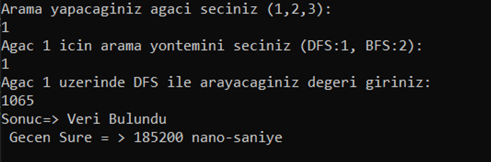

<h1>Veri Yapıları Dersi DFS-BFS-İkili Arama Ağacı Ödevi</h1>
<h3>1. Giriş</h3>

Ödevi geliştirirken Yığın,Kuyruk ve İkiliSiralamaAgaci veri yapılarını kullandım.  
Yığın veri yapısını, DFS algoritmasını gerçeklemek için, Kuyruk veri yapısını, BFS algoritmasını gerçeklemek için, İkili Siralama Agaci veri yapısını ise ilgili düğümleri belirli bir düzen içerisinde yerleştirmek için kullandım.
İkili arama ağacı, BFS ve DFS algoritmalarından kısaca bahsedecek olursak;

<b>İkili Siralama Ağacı çalışma mantığı:</b> Önce kök düğümden başlar, alınan veri, kök düğümden büyük ise kökün sağ çocuğuna bakılır, sağ çocuk yok ise düğüm oraya yerleştirilir fakat eğer varsa o düğüme bakılır, yine aynı mantıkla büyük ise sağa küçük ise sol tarafına bakılır ve boş olan kısma gidene kadar rekürsif olarak dolaşır ve veriyi uygun yere yerleştirir.  

<b>DFS(Depth First Search(Derinlik Öncelikli Arama)) arama algoritması çalışma mantığı: </b> Bu arama algoritmasında stack(yığın) veri yapısı kullanılır.
<ul>
    <li>Önce kök düğüm stack'e eklenir.</li>
    <li>Eklenilen düğümün ziyaret edilmeyen komşu düğümü eklenip son düğüme kadar gidilir.</li>
    <li>Sonra geri dönülür ve bir önceki düğümün ziyaret edilmeyen komşu düğümleri eklenir. Eğer ziyaret edilmeyen komşu düğüm yoksa bu düğüm stackden çıkarılır ve çıkardığımız bu düğümün verisi bizim aradığımız veriye eşitmi diye bakılır. Bu işlem ziyaret edilmeyen komşu düğüm kalmayana kadar tekrar edilir, eğer aranan veri bulunursa işlem bitirilir, ve aramadan çıkılır. fakat bulamazsa stack boşalana işlem kadar devam eder.</li>
</ul>

<b>DFS(Depth First Search(Derinlik Öncelikli Arama)) arama algoritması çalışma mantığı: </b> Bu arama algoritmasında queue(kuyruk) veri yapısı kullanılır.

<ul>
    <li>Önce kök düğüm, kuyruğa eklenir.</li>
    <li>Kuyruğun başındaki elemanın ziyaret edilmeyen komşu düğümleri kuyruğa eklenir. bir önceki adımda eklenilen düğüm(kuyruğun başındaki düğüm) kuyruktan çıkarılır ve her adımda bu işlem tekrar edilir.</li>
    <li>Kuyruktan çıkarılan elemanın verisi bizim aradığımız veriye eşitse aranan değer bulunur ve işlem bitirilir. fakat bulamazsa queue(kuyruk) boşalana kadar işlem devam eder.</li>
</ul>
 
Kullandığım DFS algoritmasında ziyaret edilmemiş çocuk düğümlerle gidilip ilgili işlemleri yaparken, BFS her bir çocuk düğümü bellekte tutar. Bu nedenle DFS ‘ nin bellek tüketimi daha verimlidir.

<h3>2. Program Akışı</h3>

    Geliştirdiğim program ilk önce kullanıcıdan seçeceği ağacı alır ve agacKur fonksiyonuna ilgili diziyi gönderir. Gönderdiğim diziye göre ikili sıralama ağacı mantığına göre  elemanlar ağaçta sıralanır.(kök - sağ çocuk(kök düğümden büyük eleman, - sol çocuk(kök düğümden küçük eleman))). Ardından hangi arama yöntemi ile arama yapılacağının bilgisi kullanıcıdan alınır. Hemen ardından kullanıcıdan arayacağı değer alınır, ilgili arama algoritmasının, arama işlemini ne kadar sürede gerçekleştirdiğini görebilmek için süre başlatılır. Kullanıcıdan aldığımız bu bilgilere göre ilgili arama algoritması çağırılır (BFS,DFS) . Ve bu algoritmalara parametre olarak kök düğümü ve kullanıcıdan aldığımız aranacak değer gönderilir. Arama işlemi başlanır. Ardından kullanıcıya gönderdiği değeri bulup bulamadığına dair, ve bu işlemin ne kadar sürede gerçekleştirildiğine dair çıktılar verilir, ve ağaçtaki tüm düğümler sisteme geri iade edilip program sonlanır.

<h3>3. Ekran Görüntüleri</h3>

<h3>4. Kullanılan Teknolojiler ve Dil:</h3>
Visual Studio Console Application - C++

<h3>5. Sonuç:</h3>

Ödevi geliştirirken İkili sıralama ağacının çalışma mantığını, BFS,DFS algoritmalarının ne şekilde çalıştığını ve bu algoritmaların altında hangi veri yapıları bulunduğunu görüp, bu algoritmaları performans açısından kıyaslama kazanımlarını ve deneyimlerini kazandığımı söyleyebilirim.
